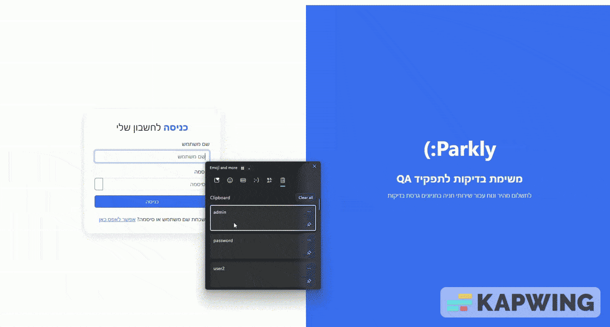
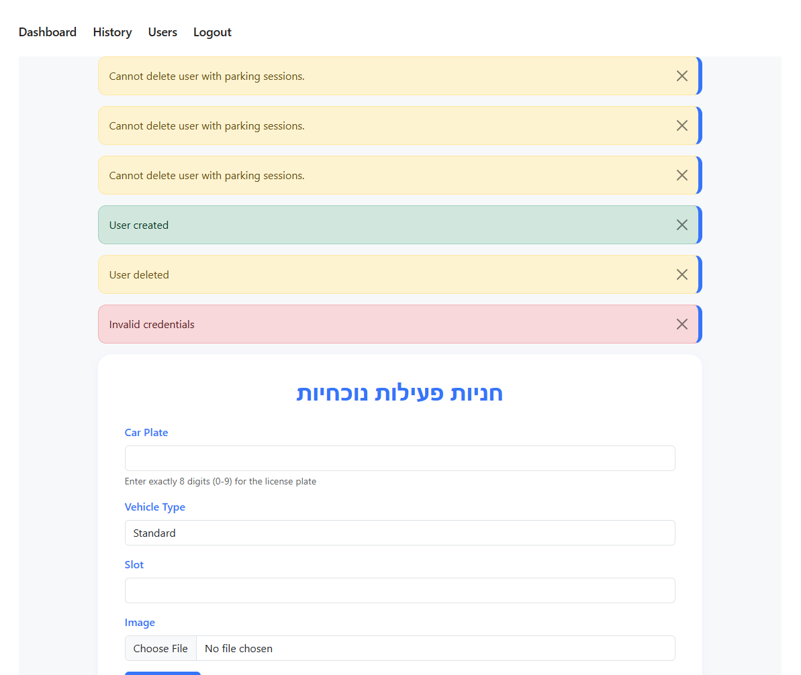
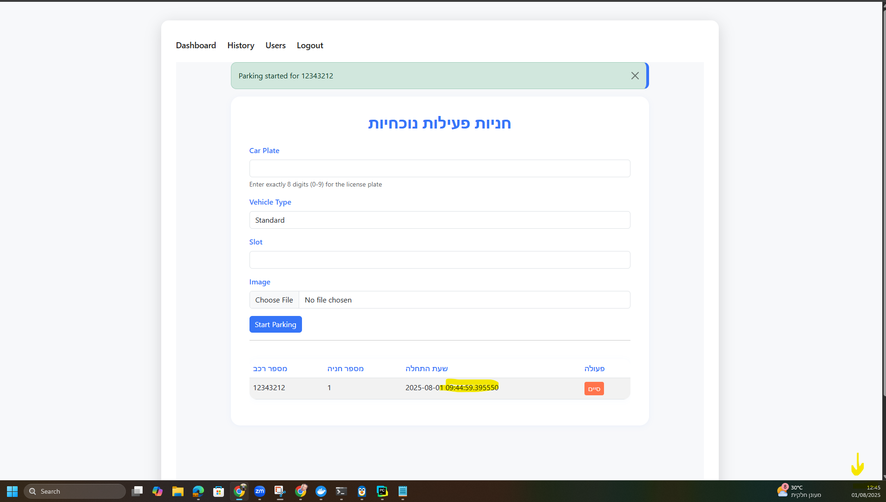

# Bug Report

## Bug 1: Same vehicle appears under different users

### Steps to Reproduce:
1. Login as User A  
2. Start a parking session for example ->  plate number: `12121212`, slot:1  
3. Log out  
4. Login as User B  
5. Check the active parking list

### Actual Result:
The vehicle started by User A appears under User B’s session.

### Expected Result:
Vehicles started by one user should not appear in another user’s session. Each user should only see vehicles they parked.

### Screenshot (optional):

---

## Bug 2: Alerts appear on dashboard instead of relevant screen

### Steps to Reproduce:
1. Trigger any error or success alert for example: start parking, stop parking, invalid credentials etc.  
2. Go to Dashboard page

### Actual Result:
All alerts appear only on the dashboard, regardless of where the action was performed.

### Expected Result:
Alerts should appear on the same screen where the action occurred, providing contextual feedback.

### Screenshot:

---

## Bug 3: Parking time does not match local time

### Steps to Reproduce:
1. Start a parking session  
2. Check the time displayed in the active parking table

### Actual Result:
The start time shown does not match the real local time (Israel timezone).

### Expected Result:
Parking start time should reflect the actual local time according to the user's timezone settings.

### Screenshot:

---

